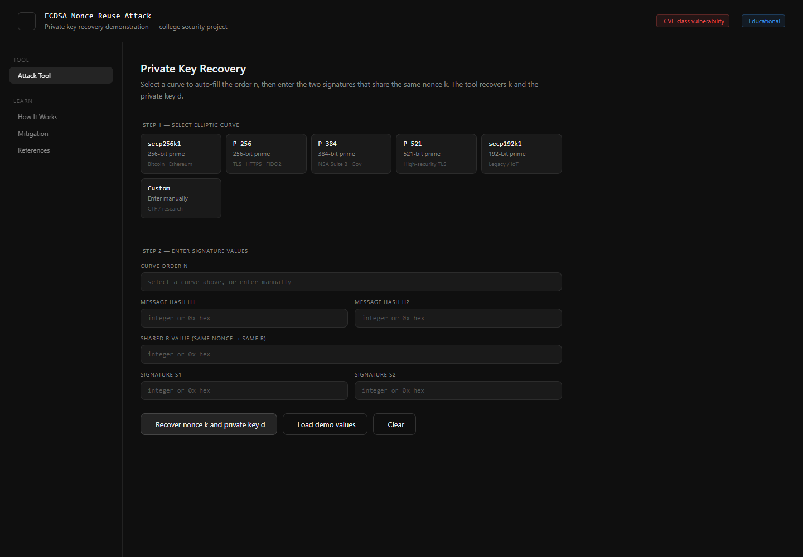
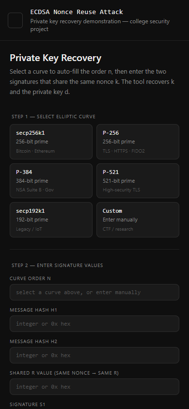

# ECDSA Nonce Reuse Educational Tool

A standalone browser-based tool for demonstrating how ECDSA private keys can be recovered when the same nonce is reused across signatures.

## Use the tool

Open the hosted version:

[https://katiyar-crypto.github.io/ecdsa-nonce-reuse-tool/](https://katiyar-crypto.github.io/ecdsa-nonce-reuse-tool/)

## Screenshots

## Run locally

Open `index.html` in a browser.

## GitHub Pages

This project includes a GitHub Pages workflow. After changes are pushed to `main`, GitHub Actions publishes the tool at:

[https://katiyar-crypto.github.io/ecdsa-nonce-reuse-tool/](https://katiyar-crypto.github.io/ecdsa-nonce-reuse-tool/)

## Note

This tool is intended for educational and defensive security learning only.

## License

Licensed under the Apache License 2.0.
